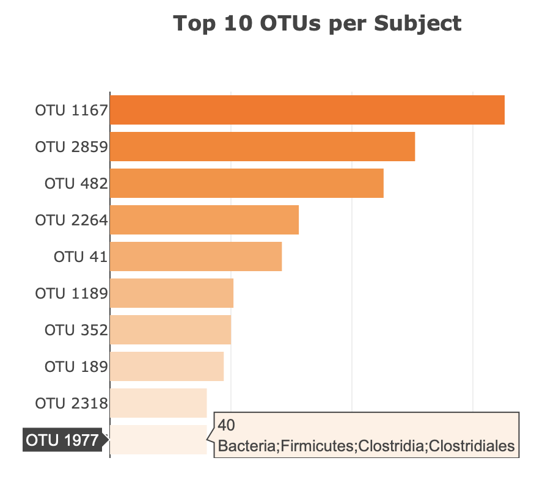
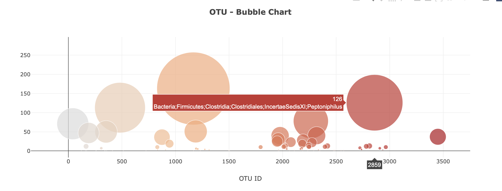
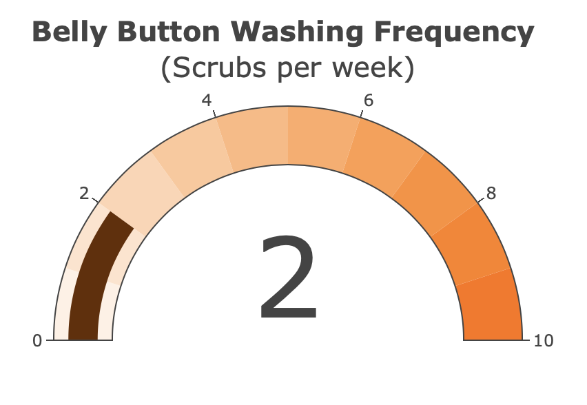

# Plot.ly Homework - Belly Button Biodiversity

The live deployed webpage can be found here: [Bio Diversity Dashboard](https://zenacar.github.io/BioDiversity-Analysis/)

An interactive dashboard to explore the Belly Button Biodiversity dataset, which catalogs the microbes that colonize human navels.

1. Create a horizontal bar chart with a dropdown menu to display the top 10 OTUs found in that individual.

  

2. Create a bubble chart that displays each sample.

3. Display the sample metadata, i.e., an individual's demographic information.

4. Display each key-value pair from the metadata JSON object somewhere on the page.

5. Update all of the plots any time that a new sample is selected.

6. Adapt the Gauge Chart to plot the weekly washing frequency of the individual. Update the chart whenever a new sample is selected.

